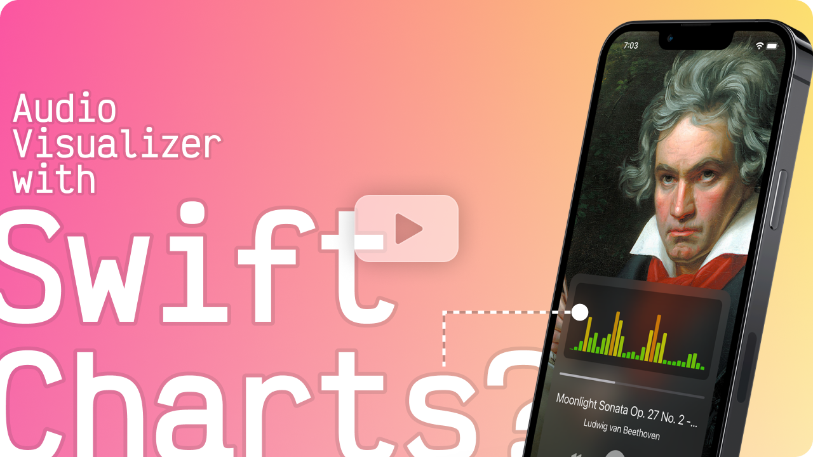

[videoURL]: https://www.youtube.com/watch?v=8kX1CX-ujlA

# SwiftChartsAudioVisualizer
This is the source code for my tutorial video:

[][videoURL]  
Check the video on [YouTube][videoURL]

---

This WWDC, Apple introduced Swift Charts, a convenient way to add charts to your app with SwiftUI. But can it handle data that changes several times per second?  
This is a little experiment to test it, making an audio visualizer using the BarMark. And it actually runs a lot better than I would expect.

Reference Links:
- [But what is the Fourier Transform? A visual introduction](https://www.youtube.com/watch?v=spUNpyF58BY)
- [Audio Visualization in Swift Using Metal and Accelerate](https://betterprogramming.pub/audio-visualization-in-swift-using-metal-accelerate-part-1-390965c095d7)
- [Light Entertainment - Rack-mountable Spectrum Analyser & DB Meter](https://www.youtube.com/watch?v=CKvP4GjoLZc)
- [Paul Pitman - Moonlight Sonata Op. 27 No. 2 - III. Presto](https://musopen.org/music/2547-piano-sonata-no-14-in-c-sharp-minor-moonlight-sonata-op-27-no-2/)